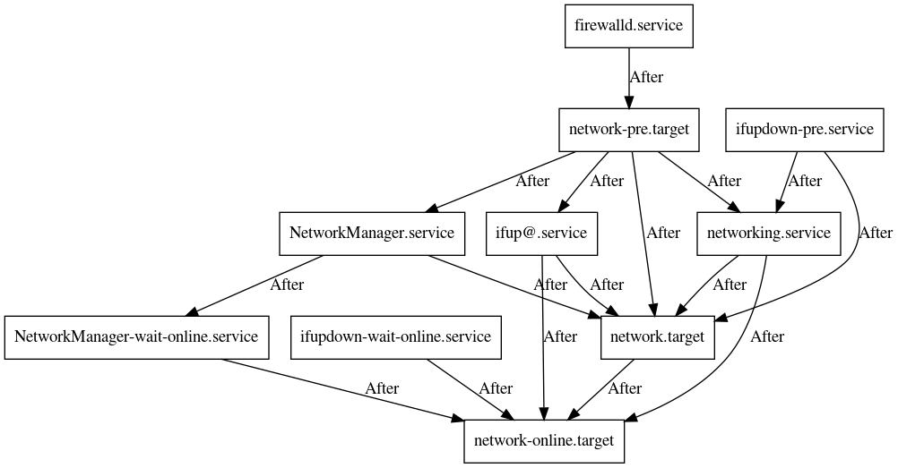

# Quick and dirty solutions to some frustrating problems

## systemd-graph.py

A simple tool similar to the [systemd-analyze dot][sad] command. I wasn't 
satisfied with its output. I wanted to get a simple graph of 
dependencies to determine what has to change to make firewall fails 
critical and abort networking activation then.

    $ cd /lib/systemd/system
    $ ~/systemd-graph.py -r after -oA firewalld.service ifup* network* | dot -Tpng > ~/systemd-graph-after.png

Further reading:

- [I am not convinced that the firewall being broken should break the 
  boot](https://lists.freedesktop.org/archives/systemd-devel/2014-June/019917.html)
- [there are no listening services yet, are 
  there?](https://lists.freedesktop.org/archives/systemd-devel/2014-June/019797.html)
- [#79600 Add a network-pre.target to avoid firewall 
  leaks](https://bugs.freedesktop.org/show_bug.cgi?id=79600)
- [#766938 systemd: network-pre.target doesn't seem to be guaranteed to 
  run before the network is 
  up](https://bugs.debian.org/cgi-bin/bugreport.cgi?bug=766938)
- [systemd: Start your Firewall before network interfaces coming 
  up](https://andidittrich.com/2017/03/systemd-start-your-firewall-before-network-interfaces-coming-up.html)

[sad]: https://www.freedesktop.org/software/systemd/man/systemd-analyze.html

## x-paste-htmltable-as-csv

Select a part of a table in a internet browser (e.g. Firefox) using 
the mouse while keeping the Ctrl key down. Copy it to clipboard. Then 
paste the table in the CSV format in another program (e.g. vim,
`:r !x-paste-htmltable-as-csv`).

Without using this kind of a script cells were pasted line by line also 
including the excess whitespace. It no longer seems to be the case with 
Firefox 78.8.0esr.

It's useful to use the vim [Tabular] plug-in after pasting the CSV 
contents.

[Tabular]: https://github.com/godlygeek/tabular
